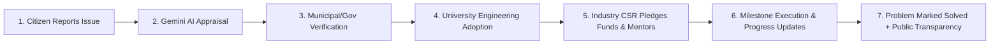

# AwaazGram 🇮🇳 — Turning Real Civic Problems into Real Engineered Solutions

**Civic Technology & Collaboration Platform**

A unified platform connecting **Citizens, Universities, Industry, and Government** to solve hyper-local infrastructure, environmental, energy, and healthcare challenges.

---

## 🌟 Core Pillars & End-to-End Workflow



1. **Citizen Portal**: Report civic grievances with GPS tagging, descriptions, categories, and photos/video uploads.
2. **Gemini AI Diagnostics**: Automated semantic triage analyzing urgency, civic impact score, feasibility, estimated grant budget, timeline, and recommended university engineering disciplines.
3. **Government Verification Hub**: Municipal commissioners and smart city directors review AI appraisals, approve priority, and allocate municipal seed funds.
4. **University Innovation Hub**: Engineering student teams and faculty mentors adopt challenges, build IoT/civil prototypes, manage milestone roadmaps, and submit progress updates.
5. **Corporate CSR & Incubation Portal**: Industry leaders (Tata CSR, Tech Mahindra Makers Lab) pledge grants, hardware kits, and technical mentors.
6. **Public Transparency & Expense Ledger**: Open ledger itemizing procurement expenses, invoices, and before/after deployment comparisons.
7. **College Leaderboard**: Real-time national rankings based on verified solved projects, impact points, and innovation badges.
8. **Admin Control Room**: System health, status distribution donut chart, and category breakdown analytics with Recharts.

---

## 🚀 Quick Start Instructions

### Prerequisites
- Node.js (v18+) & NPM

### 1. Start Backend API Server
```bash
cd server
npm install
npm start
```
*Backend runs on `http://localhost:5000`*

### 2. Start Frontend Client (in a separate terminal)
```bash
cd client
npm install
npm run dev
```
*Frontend runs on `http://localhost:5173`*

---

## ⚙️ Environment Variables (`server/.env`)

| Variable | Description | Default / Fallback |
|---|---|---|
| `PORT` | API Server Port | `5000` |
| `GEMINI_API_KEY` | Google Gemini API Key | Built-in AwaazGram Civic AI Heuristic Engine |
| `MONGODB_URI` | MongoDB Connection URL | Local high-fidelity JSON storage with disk sync |
| `FIREBASE_PROJECT_ID` | Firebase Project ID | Local static media storage fallback |

---

## 🎭 1-Click Presentation Personas
Use the top interactive bar to instantly switch personas during live demonstration:
- **Rahul Mishra** (Citizen Reporter - Ward 12, Bhopal)
- **Anita Sharma** (Government / Municipal Verification Officer)
- **Prof. Kumar** (University / MANIT Innovation Hub)
- **Amit Verma** (Industry / Tata CSR Lead)
- **Central Admin** (National Civic Network Coordinator)
